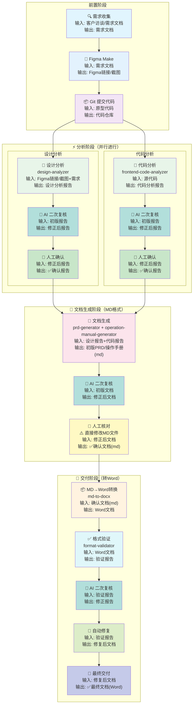

# 项目工作流程图

## Mermaid 流程图



---

## 双重校验机制

每个阶段完成后，都必须经过 **AI 二次复核** + **人工核对** 两个环节，确保内容准确无误。

---

## Skill 详细说明

### 1. design-analyzer (设计分析)

#### 能力
- 基于Figma原型（Figma链接/截图）提取页面结构和功能布局
- 分析交互流程和页面跳转关系
- 解读设计意图和数据展示规范
- **AI 二次复核**：检查设计意图与设计证据的一致性
- **人工确认机制**：AI分析结果必须经过用户确认

#### 核心原则

| 原则 | 说明 |
|------|------|
| **必须基于设计证据** | 分析内容必须能在 Figma链接 或 截图中找到依据 |
| **设计意图透明** | 区分"已确认"与"AI推断" |
| **待确认项标注** | 无法确定的内容使用【待确认】标注 |

**证据来源**：Figma 链接提供结构化数据，原型截图提供视觉证据。

| 输入类型 | 说明 | 格式 | 推荐度 |
|----------|------|------|--------|
| **Figma 分享链接** | 原型公开分享链接 | URL | ⭐⭐⭐ 首选 |
| **原型截图** | 每个页面的截图 | PNG/JPG | ⭐⭐ 备选 |
| 页面清单 | 页面名称、编号 | 文本/表格 | 推荐 |
| 需求文档 | 客户原始需求 | 文档 | 可选 |

#### 核心流程

```
┌─────────────────────────────────────────────────────────────┐
│  Step 1: 整理输入材料 ⚠️ 必须完整                            │
│  - 确认 Figma链接/截图 覆盖所有页面                         │
│  - 建立页面清单                                              │
├─────────────────────────────────────────────────────────────┤
│  Step 2: 页面结构分析 ⚠️ 必须逐一分析                        │
│  - 页面功能、元素、布局结构                                  │
│  - 交互元素、状态设计                                        │
├─────────────────────────────────────────────────────────────┤
│  Step 3: 功能模块划分 ⚠️ 建立映射                            │
│  - 模块与页面的映射关系                                      │
├─────────────────────────────────────────────────────────────┤
│  Step 4: 交互流程分析 ⚠️ 提取跳转关系                        │
│  - 页面跳转关系、主要业务流程                                │
├─────────────────────────────────────────────────────────────┤
│  Step 5: 数据展示规范 ⚠️ 提取字段信息                        │
│  - 字段定义、格式要求、脱敏规则                              │
├─────────────────────────────────────────────────────────────┤
│  Step 6: 权限设计说明 ⚠️ 标注设计意图                        │
│  - 角色定义、功能权限矩阵                                    │
├─────────────────────────────────────────────────────────────┤
│  Step 7: 【完整性验证】⚠️ 必须执行                          │
│  - 覆盖率必须100%                                           │
├─────────────────────────────────────────────────────────────┤
│  Step 8: 【二次校验】自洽性检查 ⭐                           │
│  - 视觉一致性、逻辑一致性、推断合理性                        │
├─────────────────────────────────────────────────────────────┤
│  Step 9: 用户确认 ⭐                                        │
│  - 确认后可进入下一阶段                                      │
└─────────────────────────────────────────────────────────────┘
```

#### 禁止行为清单

```
┌─────────────────────────────────────────────────────────────┐
│                    ❌ 禁止行为清单                            │
├─────────────────────────────────────────────────────────────┤
│  1. ❌ 禁止仅凭主观想象补充设计细节                         │
│     必须基于 Figma链接 或 截图中的实际元素                   │
│                                                              │
│  2. ❌ 禁止跳过任何页面的分析                               │
│     必须对所有页面逐一分析                                   │
│                                                              │
│  3. ❌ 禁止将"推测"当作"确认"                              │
│     无法确定的设计必须标注【待确认】                         │
│                                                              │
│  4. ❌ 禁止忽略页面之间的跳转关系                           │
│     必须分析完整的页面流程                                   │
│                                                              │
│  5. ❌ 禁止遗漏组件/元素的分析                               │
│     表单、列表、按钮等必须逐一记录                           │
│                                                              │
│  6. ❌ 禁止忽略 Figma链接可获取的精确属性                   │
│     应充分利用 Figma链接获取精确的组件属性                   │
└─────────────────────────────────────────────────────────────┘
```

#### 产出内容
```
├── 设计分析报告
│   ├── 分析覆盖率统计
│   ├── 页面结构分析（每个页面）
│   ├── 功能模块划分
│   ├── 交互流程描述
│   ├── 数据展示规范
│   ├── 权限设计说明
│   ├── 设计意图记录（确认/待确认）
│   ├── 完整性验证报告
│   └── 二次校验报告
│
└── 关联文件
    ├── references/page-structure-template.md
    ├── references/interaction-flow-template.md
    └── references/data-field-template.md
```

---

### 2. frontend-code-analyzer (前端代码分析)

#### 能力
- 分析前端代码结构，提取业务逻辑和技术实现
- 识别页面组件、功能模块、数据流
- 提取 API 接口信息
- 映射组件与功能对应关系
- **AI 二次复核**：自动检查代码与报告内容匹配性

#### 核心流程

```
┌─────────────────────────────────────────────────────────────┐
│  Step 1: 项目扫描 ⚠️ 必须完整                               │
│  - 遍历项目文件，识别页面路由和组件结构                      │
├─────────────────────────────────────────────────────────────┤
│  Step 2: 页面分析 ⚠️ 必须逐一分析                           │
│  - 读取每个页面代码，提取实际功能                           │
├─────────────────────────────────────────────────────────────┤
│  Step 3: API分析 ⚠️ 必须分析每个API                        │
│  - 端点、请求参数、响应结构、错误处理                       │
├─────────────────────────────────────────────────────────────┤
│  Step 4: 组件分析 ⚠️ 必须分析关键组件                       │
│  - Props定义、组件用途、状态定义、交互行为                  │
├─────────────────────────────────────────────────────────────┤
│  Step 5: 生成分析摘要                                       │
│  - 项目概览、功能模块列表、API清单、页面清单                │
├─────────────────────────────────────────────────────────────┤
│  Step 6: 【完整性验证】⚠️ 必须执行                          │
│  - 文件覆盖率必须100%                                       │
├─────────────────────────────────────────────────────────────┤
│  Step 7: 【二次校验】自洽性检查 ⭐                          │
│  - 代码引用校验：页面数量、API调用、组件映射                │
├─────────────────────────────────────────────────────────────┤
│  Step 8: 用户确认 ⭐                                        │
│  - 确认后可进入下一阶段                                     │
└─────────────────────────────────────────────────────────────┘
```

#### 禁止行为清单

```
┌─────────────────────────────────────────────────────────────┐
│                    ❌ 禁止行为清单                            │
├─────────────────────────────────────────────────────────────┤
│  1. ❌ 禁止仅分析目录结构                                   │
│  2. ❌ 禁止仅提取文件名称作为功能                           │
│  3. ❌ 禁止跳过任何页面或组件                               │
│  4. ❌ 禁止使用"模块名"推断功能                             │
│  5. ❌ 禁止跳过API详情分析                                  │
└─────────────────────────────────────────────────────────────┘
```

#### 产出内容
```
├── 代码分析报告
│   ├── 分析覆盖率统计
│   ├── 项目概览
│   ├── 完整功能模块列表
│   ├── 完整API清单
│   ├── 完整页面清单
│   ├── 核心代码片段
│   ├── 完整性验证报告
│   └── 二次校验报告
│
└── 关联文件
    ├── references/api-reference.md
    └── references/component-mapping.md
```

---

### 3. prd-generator (PRD文档生成)

#### 能力
- 基于设计分析和代码分析结果生成标准PRD文档
- 自动按PRD文档模板格式输出
- 内容来源标注（区分AI生成与用户提供）
- 与规范标准自动对齐
- **AI 二次复核**：检查文档内容与设计/代码分析的一致性

#### 核心流程

```
┌─────────────────────────────────────────────────────────────┐
│  Step 1: 读取完整分析报告 ⚠️ 必须完整                        │
│  - 读取设计分析报告完整内容                                 │
│  - 读取代码分析报告完整内容                                 │
├─────────────────────────────────────────────────────────────┤
│  Step 2: 整理信息映射表 ⚠️ 建立映射                         │
│  - 设计报告 → PRD章节                                       │
│  - 代码报告 → PRD章节                                       │
│  - 覆盖率100%                                              │
├─────────────────────────────────────────────────────────────┤
│  Step 3: 生成文档结构                                       │
│  - 使用 PRD文档模板V1.0.md                                  │
├─────────────────────────────────────────────────────────────┤
│  Step 4: 【完整性校验】PRD ↔ 分析报告一致性 ⭐              │
│  - 模块覆盖、页面覆盖、API覆盖检查                          │
├─────────────────────────────────────────────────────────────┤
│  Step 5: 【二次校验】PRD自洽性检查 ⭐                        │
│  - 输入-输出一致性校验                                       │
├─────────────────────────────────────────────────────────────┤
│  Step 6: 用户核对 ⭐                                        │
│  - 确认后可进入下一阶段                                     │
└─────────────────────────────────────────────────────────────┘
```

#### 禁止行为清单

```
┌─────────────────────────────────────────────────────────────┐
│                    ❌ 禁止行为清单                            │
├─────────────────────────────────────────────────────────────┤
│  1. ❌ 禁止仅读取分析摘要                                   │
│  2. ❌ 禁止仅读取"模块名称"                                 │
│  3. ❌ 禁止仅读取部分页面/组件                              │
│  4. ❌ 禁止跳过API详情                                      │
│  5. ❌ 禁止仅凭摘要推断功能                                 │
└─────────────────────────────────────────────────────────────┘
```

#### 完整性保证三步法

```
Step 1: 读取时验证 → 记录模块数、页面数、API数
Step 2: 生成时核对 → 逐项核对每个模块→页面→API
Step 3: 校验时确认 → 覆盖率必须是100%，否则拒绝交付
```

#### 内容标注规范

| 标注 | 格式 | 说明 |
|------|------|------|
| 已确认 | ✅ 【已确认-来源】 | 分析结果确认 |
| AI推断 | ⚠️ 【AI推断-需验证】 | AI合理推断，需验证 |
| 待确认 | ❓ 【待确认-XXX】 | 无法确定，需补充 |

#### 产出内容
```
├── PRD文档
│   ├── 文档版本说明
│   ├── 一、文档前言（项目背景、目标、范围）
│   ├── 二、产品概述（产品介绍、功能清单）
│   ├── 三、功能详细说明
│   │   ├── 功能模块划分
│   │   ├── 功能点详细描述
│   │   └── 业务流程图
│   ├── 四、非功能性需求
│   ├── 五、附录
│   ├── 完整性校验报告
│   └── 二次校验报告
│
└── 关联文件
    ├── PRD文档模板V1.0.md
    └── PRD文档规范标准V1.0.md
```

---

### 4. operation-manual-generator (操作手册生成)

#### 能力
- 基于PRD文档和代码分析结果生成操作手册
- 自动按操作手册模板格式输出
- 包含操作步骤、界面说明、注意事项
- **前后依赖二次校验**：交叉比对PRD与手册内容一致性
- **AI 二次复核**：检查操作步骤的可执行性

#### 核心流程

```
┌─────────────────────────────────────────────────────────────┐
│  Step 1: 整理输入信息                                       │
│  - 从PRD和代码分析中提取功能模块和操作信息                   │
├─────────────────────────────────────────────────────────────┤
│  Step 2: 生成文档结构                                       │
│  - 使用 操作手册模板V1.0.md                                 │
├─────────────────────────────────────────────────────────────┤
│  Step 3: 操作步骤编写                                       │
│  - 已确认/AI推断/待确认 标注                                 │
├─────────────────────────────────────────────────────────────┤
│  Step 4: 【二次校验】操作手册自洽性检查 ⭐                  │
│  - 输入一致性、步骤逻辑、推断合理性、完整性                 │
│  - PRD-操作手册一致性校验（前后依赖）                       │
├─────────────────────────────────────────────────────────────┤
│  Step 5: 用户核对 ⭐                                        │
│  - 确认后可进入下一阶段                                     │
└─────────────────────────────────────────────────────────────┘
```

#### 操作步骤格式规范

```
### 4.1.2 【功能点名称】

**操作前提**：
● 【已确认/AI推断】权限要求
● 【已确认/AI推断】前置条件

**操作步骤**：
1. 【步骤描述】
2. 【步骤描述】

**验证方法**：
● 【验证点】

**⚠️ AI推断-需验证项**：
● [推断项] - [验证建议]
```

#### 产出内容
```
├── 操作手册
│   ├── 封面
│   ├── 文档版本说明
│   ├── 0. 快速开始
│   ├── 一、文档前言
│   ├── 二、系统概述
│   ├── 三、用户角色与权限说明
│   ├── 四、【功能模块一】
│   ├── 五、【功能模块二】
│   ├── 六、常见问题FAQ
│   ├── 二次校验报告
│   └── 前后依赖校验记录
│
└── 关联文件
    ├── 操作手册模板V1.0.md
    └── 操作手册规范标准V1.0.md
```

---

### 5. md-to-docx (MD转Word)

#### 能力
- 将 Markdown 文档转换为 Word 格式
- 支持自定义 Word 模板（页眉页脚、样式等）
- 自动处理文档中的图片引用
- MD 语法到 Word 样式的智能映射

#### 核心流程

```
┌─────────────────────────────────────────────────────────────┐
│  Step 1: 模板准备（首次使用）                               │
│  - 准备 Word 模板文件（.dotx 或 .docx）                     │
│  - 定义标题、正文、表格、列表等样式                          │
├─────────────────────────────────────────────────────────────┤
│  Step 2: MD 文档检查                                       │
│  - 验证 MD 语法正确性                                      │
│  - 检查图片路径有效性                                      │
│  - 确保文档结构完整                                        │
├─────────────────────────────────────────────────────────────┤
│  Step 3: 执行转换                                          │
│  - pandoc 转换（推荐）                                     │
│  - 或使用 python-docx / docx-templates 库                   │
├─────────────────────────────────────────────────────────────┤
│  Step 4: 格式校验                                          │
│  - 转换后自动调用 format-validator                         │
│  - 检查是否符合 Word文档格式规范标准V1.0.md                 │
├─────────────────────────────────────────────────────────────┤
│  Step 5: 修复与交付                                        │
│  - 根据验证报告修复格式问题                                │
│  - 确认无误后最终交付                                      │
└─────────────────────────────────────────────────────────────┘
```

#### 转换工具推荐

| 工具 | 命令 | 说明 |
|------|------|------|
| **Pandoc** | `pandoc input.md -o output.docx --reference-doc=template.docx` | 推荐，跨平台 |
| **Python-docx** | Python 库编程转换 | 可自定义逻辑 |
| **Turndown** | Node.js 库 | 适合前端项目 |

#### 禁止行为清单

```
┌─────────────────────────────────────────────────────────────┐
│                    ❌ 禁止行为清单                            │
├─────────────────────────────────────────────────────────────┤
│  1. ❌ 禁止跳过模板配置                                     │
│     必须使用规范化的 Word 模板                               │
│                                                              │
│  2. ❌ 禁止忽略图片路径问题                                  │
│     图片必须能正确嵌入 Word                                 │
│                                                              │
│  3. ❌ 禁止直接复制粘贴生成                                  │
│     必须使用专业转换工具保证格式一致                         │
└─────────────────────────────────────────────────────────────┘
```

#### 产出内容
```
├── 转换后的 Word 文档
├── 转换日志（图片处理、警告信息）
└── 格式验证报告（调用 format-validator）
```

#### 关联文件
- `Word文档格式规范标准V1.0.md`
- Word 模板文件（.docx/.dotx）

---

### 6. format-validator (格式规范验证)

#### 能力
- 自动检查Word文档格式是否符合公司标准规范
- 检查项目：字体、字号、间距、对齐、列表、表格等
- **AI 二次复核**：检查规范标准的符合性
- **自动修复功能**：自动修复可修复的格式问题

#### 核心流程

```
┌─────────────────────────────────────────────────────────────┐
│  Step 1: 文档加载                                           │
│  - 解析Word文档结构                                         │
├─────────────────────────────────────────────────────────────┤
│  Step 2: 执行检查 ⚠️ 100%覆盖                               │
│  - 字体、间距、对齐、列表、表格、页面                       │
├─────────────────────────────────────────────────────────────┤
│  Step 3: 对比规范标准                                       │
│  - 读取 Word文档格式规范标准V1.0.md                          │
├─────────────────────────────────────────────────────────────┤
│  Step 4: 生成报告                                           │
│  - 汇总检查结果（critical/major/minor）                     │
│  - 提供修复建议                                             │
├─────────────────────────────────────────────────────────────┤
│  Step 5: AI 二次复核 ⭐                                     │
│  - 问题识别准确性、修改建议可行性                           │
├─────────────────────────────────────────────────────────────┤
│  Step 6: 自动修复（如需要）                                 │
│  - 识别可修复项、批量应用修复                               │
└─────────────────────────────────────────────────────────────┘
```

#### 检查项目明细

| 类别 | 检查项 |
|------|--------|
| **字体** | 字体名称、字号大小、加粗/斜体、中英文字体混用 |
| **间距** | 行距一致性、段落间距、首行缩进 |
| **对齐** | 标题对齐、正文对齐、表格对齐、图片对齐 |
| **列表** | 有序列表编号、无序列表符号、嵌套层级 |
| **表格** | 边框样式、列宽比例、表头格式 |
| **页面** | 页边距、纸张大小、页眉页脚、页码格式 |

#### 质量指标

| 指标类型 | 标准 |
|----------|------|
| 关键项合格率 | 100% |
| 重要项合格率 | ≥95% |
| 整体合规率 | ≥95% |

#### 自动修复功能

| 可自动修复 | 需要手动处理 |
|-----------|-------------|
| 字体名称统一 | 内容逻辑错误 |
| 行距调整 | 表格结构问题 |
| 首行缩进设置 | 图片位置调整 |
| 列表符号规范化 | 跨页断行处理 |

#### 产出内容
```
├── 格式验证报告 (JSON/HTML)
│   ├── 检查概览（总项数、合格/不合格数）
│   ├── 严重程度统计（critical/major/minor）
│   ├── 详细问题清单
│   ├── 修复建议
│   └── 二次复核修正记录
│
└── 关联文件
    └── Word文档格式规范标准V1.0.md
```

---

## 完整流程说明

| 阶段 | 步骤 | 节点 | 调用的 Skill | 输入 | 输出物 |
|------|------|------|-------------|------|--------|
| **前置阶段** | 1 | 需求收集 | - | - | 需求文档 |
| | 2 | Figma Make 原型设计 | - | - | Figma链接/截图 |
| | 3 | Git 提交代码 | - | - | 代码仓库 |
| **⚡ 分析阶段（并行）** | 4a | 设计分析 | **design-analyzer** | Figma链接/截图 + 需求文档 | ✅ 设计分析报告 |
| | 4a.1 | AI 二次复核 | - | - | 修正后报告 |
| | 4a.2 | 人工确认 | - | - | ✅ 确认 |
| | 4b | 代码分析 | **frontend-code-analyzer** | 源代码 | ✅ 代码分析报告 |
| | 4b.1 | AI 二次复核 | - | - | 修正后报告 |
| | 4b.2 | 人工确认 | - | - | ✅ 确认 |
| **📝 文档生成阶段（MD）** | 5 | 文档生成 | **prd-generator**<br/>**operation-manual-generator** | 设计报告 + 代码报告 | 初版文档(md) |
| | 5.1 | AI 二次复核 | - | - | 修正后文档 |
| | 5.2 | 👤 人工核对 | - | - | ✅ 直接修改md确认 |
| **📄 交付阶段（转Word）** | 6 | MD→Word转换 | **md-to-docx** | 确认文档(md) | Word文档 |
| | 6.1 | 格式验证 | **format-validator** | Word文档 | 验证报告 |
| | 6.2 | AI 二次复核 | - | - | 修正报告 |
| | 6.3 | 自动修复（如需要） | - | - | 修复日志 |
| | 6.4 | 最终交付 | - | - | ✅ Word文档 |

**⚡ 并行说明**：设计分析和代码分析可以同时进行，互不依赖。两者都完成后才进入文档生成阶段。

---

## 三重保障机制

```
┌─────────────────────────────────────────────────────────────────┐
│  第一重：AI 二次复核（每个 Skill 内部）                          │
│  - 检查产出内容与输入依据的一致性                                │
│  - 识别遗漏和错误                                                │
│  - 自动修正问题                                                  │
├─────────────────────────────────────────────────────────────────┤
│  第二重：人工确认（每个 Skill 完成后）                            │
│  - 用户确认 AI 产出结果                                          │
│  - 补充 AI 无法识别的业务细节                                    │
│  - 最终授权进入下一阶段                                          │
├─────────────────────────────────────────────────────────────────┤
│  第三重：前后依赖校验（文档生成阶段）                            │
│  - 操作手册 vs PRD 模块划分一致性                                │
│  - PRD vs 设计分析 逻辑一致性                                    │
│  - PRD vs 代码分析 技术一致性                                    │
│  - 防止各阶段产出之间的不一致                                    │
└─────────────────────────────────────────────────────────────────┘
```

---

## 数据流向图

```
                                    ⚡ 并行进行
┌─────────────────────────────────────────────────────────────────────────────┐
│                                                                              │
│  需求文档 ──→ Figma Make ──→ Figma分享链接/截图                           │
│       │                                                                  │
│       │                         ┌──────────────────┐                      │
│       │                         │  design-analyzer │                      │
│       │                         └────────┬─────────┘                      │
│       │                                  │                                 │
│       │                                  ↓                                 │
│       │                          设计分析报告 ✅                          │
│       │                                                                    │
│  源代码 ──→ Git仓库                                                           │
│       │                                                                    │
│       │                         ┌──────────────────┐                      │
│       │                         │frontend-code-    │                      │
│       │                         │analyzer          │                      │
│       │                         └────────┬─────────┘                      │
│       │                                  │                                 │
│       │                                  ↓                                 │
│       │                          代码分析报告 ✅                          │
│       │                                                                    │
│       └──────────────────────────────────┬──────────────────────────────┘  │
│                                          │                                  │
│                                          ↓ (两者都完成后)                   │
│  PRD文档模板 ──────────────────→ prd-generator ──→ PRD文档(md)          │
│  操作手册模板 ─────────────────→ operation-manual ──→ 操作手册(md)        │
│                                          │                                  │
│                                          ↓                                  │
│                                   👤 人工核对(IDE直接改md)                      │
│                                          │                                  │
│                                          ↓ 确认后                           │
│  ┌─────────────────────────────────────────────────────────────────────┐  │
│  │                      📄 交付阶段：MD → Word                           │  │
│  │                                                                       │  │
│  │  确认文档(md) ──→ MD→Word转换 ──→ Word文档                          │  │
│  │                                          ↓                           │  │
│  │                                   format-validator                   │  │
│  │                                          ↓                           │  │
│  │                                     AI二次复核                       │  │
│  │                                          ↓                           │  │
│  │                                    自动修复（如需）                   │  │
│  │                                          ↓                           │  │
│  │                                       最终交付 ✅                      │  │
│  └─────────────────────────────────────────────────────────────────────┘  │
└─────────────────────────────────────────────────────────────────────────────┘
```

**⚡ 关键说明**：
- 设计分析和代码分析**完全并行**，可以同时开始、独立进行
- 两者都完成并获得人工确认后，才进入文档生成阶段
- **文档核对阶段**：使用 md 格式，IDE 直接预览，人工直接修改
- **交付阶段**：md 确认后才转 Word，格式校验通过后最终交付

---

## 质量门禁机制

```
┌─────────────────────────────────────────────────────────────────┐
│                      质量门禁检查点                              │
├─────────────────────────────────────────────────────────────────┤
│  📋 设计分析阶段                                                 │
│  ├── 覆盖率 < 100% → ❌ 拒绝交付                                │
│  └── 二次校验失败项 > 0 → ⚠️ 需修正                            │
├─────────────────────────────────────────────────────────────────┤
│  📋 代码分析阶段                                                 │
│  ├── 覆盖率 < 100% → ❌ 拒绝交付                               │
│  └── 二次校验失败项 > 0 → ⚠️ 需修正                            │
├─────────────────────────────────────────────────────────────────┤
│  📋 PRD生成阶段                                                  │
│  ├── 模块覆盖率 < 100% → ❌ 拒绝交付                           │
│  ├── 页面覆盖率 < 100% → ❌ 拒绝交付                           │
│  └── API覆盖率 < 100% → ❌ 拒绝交付                            │
├─────────────────────────────────────────────────────────────────┤
│  📋 操作手册阶段                                                 │
│  ├── 前后依赖校验失败 → ❌ 拒绝交付                            │
│  └── 待确认项 > 5 → ⚠️ 需补充                                 │
├─────────────────────────────────────────────────────────────────┤
│  📋 格式验证阶段                                                 │
│  ├── 关键项合格率 < 100% → ❌ 拒绝交付                         │
│  ├── 重要项合格率 < 95% → ❌ 拒绝交付                          │
│  └── 整体合规率 < 95% → ❌ 拒绝交付                            │
└─────────────────────────────────────────────────────────────────┘
```

---

## Skill 一览表

| Skill | 输入 | 输出 | 核心能力 | 二次校验 |
|-------|------|------|---------|---------|
| **design-analyzer** | Figma链接/截图 + 需求文档 | 设计分析报告 | 页面结构、交互流程、数据规范、组件属性 | ✅ 设计证据一致性、逻辑一致性 |
| **frontend-code-analyzer** | 源代码 | 代码分析报告 | 业务逻辑、API接口、组件映射 | ✅ 代码引用、模块映射 |
| **prd-generator** | 设计分析报告 + 代码分析报告 | PRD文档(md) | 模板填充、来源标注、一致性校验 | ✅ 完整性、输入输出 |
| **operation-manual-generator** | PRD文档 + 代码分析报告 | 操作手册(md) | 步骤编写、前后依赖校验 | ✅ PRD-手册一致性 |
| **md-to-docx** | MD文档 | Word文档 | MD→Word转换、模板应用、图片处理 | ✅ 格式一致性 |
| **format-validator** | Word文档 | 格式验证报告 | 格式检查、自动修复 | ✅ 问题识别准确性 |

**📝 文档格式说明**：

| 阶段 | 文档格式 | 说明 |
|------|---------|------|
| 文档生成阶段 | **MD** | AI生成 → 人工核对修改 → IDE直接预览 |
| 交付阶段 | **Word** | MD确认后才转换 → 格式校验 → 最终交付 |

**输入灵活性说明**：
- design-analyzer 支持 **Figma 分享链接**（首选）或 **原型截图**（备选）
- Figma 链接可获取更精确的组件属性和交互关系
- **核心原则**：无论哪种输入，分析结论都必须有明确的来源依据

> 💡 **预览方式**：将上方 Mermaid 代码复制到 [Mermaid 在线编辑器](https://mermaidonline.live/zh/flowchart) 或 [ProcessOn](https://www.processon.com/mermaid) 中查看
>
> 📝 **文档工作流**：文档生成阶段使用 **MD 格式**，人工在 IDE 中核对修改；确认后进入交付阶段转 **Word 格式**，格式校验通过后最终交付
