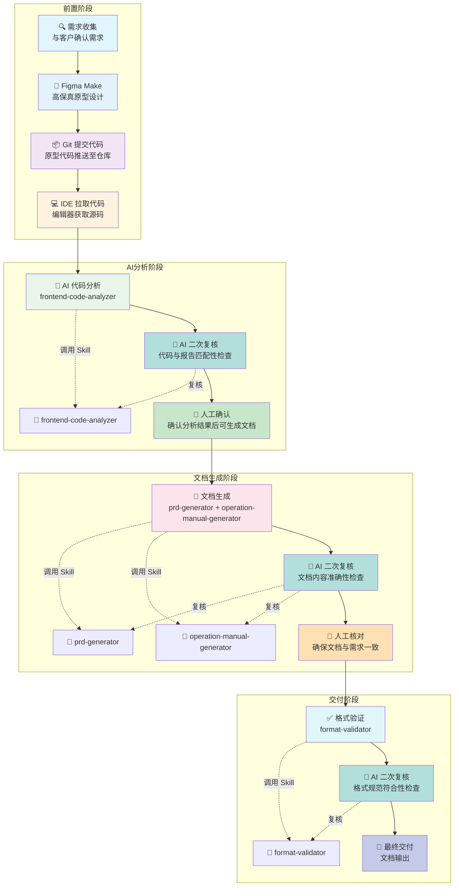

# 项目工作流程图

## Mermaid 流程图



---

## 双重校验机制

每个阶段完成后，都必须经过 **AI 二次复核** + **人工核对** 两个环节，确保内容准确无误。

---

## Skill 详细说明

### 1. frontend-code-analyzer (前端代码分析)

#### 能力
- 分析前端代码结构，提取业务逻辑和技术实现
- 识别页面组件、功能模块、数据流
- 提取 API 接口信息
- 映射组件与功能对应关系
- **AI 二次复核**：自动检查代码与报告内容匹配性

#### 核心流程

```
┌─────────────────────────────────────────────────────────────┐
│  Step 1: 代码扫描                                           │
│  - 遍历项目文件，识别页面路由和组件结构                       │
│  - 输出：项目结构树                                          │
├─────────────────────────────────────────────────────────────┤
│  Step 2: 业务提取                                           │
│  - 分析代码逻辑，提取核心业务功能点                           │
│  - 输出：功能清单                                            │
├─────────────────────────────────────────────────────────────┤
│  Step 3: 接口识别                                           │
│  - 识别 API 调用、数据交互方式                                │
│  - 输出：API 接口清单                                        │
├─────────────────────────────────────────────────────────────┤
│  Step 4: 映射生成                                           │
│  - 建立组件-功能-接口的映射关系                               │
│  - 输出：组件功能映射表                                       │
├─────────────────────────────────────────────────────────────┤
│  Step 5: AI 二次复核 ⭐                                     │
│  - 核对：代码实际内容 vs 报告描述是否一致                     │
│  - 核对：是否有遗漏的页面/组件/接口                           │
│  - 核对：功能描述是否准确反映代码逻辑                         │
│  - 如有不一致，自动修正报告内容                               │
├─────────────────────────────────────────────────────────────┤
│  Step 6: 人工确认 ⭐                                         │
│  - 用户核对最终报告内容                                       │
│  - 确认后可进入下一阶段                                       │
└─────────────────────────────────────────────────────────────┘
```

#### 产出内容
```
├── 代码分析报告
│   ├── 项目结构概览
│   ├── 页面/路由列表
│   ├── 功能模块清单
│   ├── API 接口清单
│   ├── 组件功能映射表
│   └── 复核修正记录（如有）
│
└── 关联文件
    ├── references/api-reference.md (API参考模板)
    └── references/component-mapping.md (组件映射模板)
```

---

### 2. prd-generator (PRD文档生成)

#### 能力
- 基于已确认的设计分析和代码分析结果生成标准PRD文档
- 自动按PRD文档模板格式输出
- 内容来源标注（区分AI生成与用户提供）
- 与规范标准自动对齐
- **AI 二次复核**：检查文档内容与需求/代码分析的一致性

#### 核心流程

```
┌─────────────────────────────────────────────────────────────┐
│  Step 1: 读取分析结果                                        │
│  - 获取已人工确认的前端代码分析报告                           │
│  - 获取原始需求文档（如有）                                   │
├─────────────────────────────────────────────────────────────┤
│  Step 2: 填充模板                                            │
│  - 按PRD文档模板V1.0.md结构填充内容                           │
│  - 功能描述来源于代码分析报告                                 │
├─────────────────────────────────────────────────────────────┤
│  Step 3: 来源标注                                           │
│  - 区分"用户提供"与"AI分析生成"内容                           │
│  - 标注每项内容的来源依据                                     │
├─────────────────────────────────────────────────────────────┤
│  Step 4: 内容校验                                            │
│  - 检查必要字段完整性                                         │
│  - 检查功能描述逻辑一致性                                     │
├─────────────────────────────────────────────────────────────┤
│  Step 5: AI 二次复核 ⭐                                      │
│  - 核对：PRD 功能点 vs 代码分析报告 是否一致                  │
│  - 核对：业务流程描述 vs 代码实际逻辑 是否匹配                │
│  - 核对：功能优先级是否与需求文档一致                         │
│  - 核对：是否有遗漏的功能模块                                 │
│  - 如有不一致，修正文档内容                                   │
├─────────────────────────────────────────────────────────────┤
│  Step 6: 人工核对 ⭐                                         │
│  - 用户核对文档内容准确性                                     │
│  - 确认后可进入下一阶段                                       │
└─────────────────────────────────────────────────────────────┘
```

#### 产出内容
```
├── PRD文档
│   ├── 文档版本说明
│   ├── 一、文档前言（项目背景、目标、范围）
│   ├── 二、产品概述（产品介绍、功能清单）
│   ├── 三、功能详细说明
│   │   ├── 功能模块划分
│   │   ├── 功能点详细描述
│   │   └── 业务流程图
│   ├── 四、非功能性需求
│   ├── 五、附录
│   └── 复核修正记录（如有）
│
└── 关联文件
    ├── PRD文档模板V1.0.md (模板文件)
    └── PRD文档规范标准V1.0.md (规范标准)
```

---

### 3. operation-manual-generator (操作手册生成)

#### 能力
- 基于PRD文档和已确认的代码分析结果生成操作手册
- 自动按操作手册模板格式输出
- 包含操作步骤、界面说明、注意事项
- **前后依赖二次校验**：交叉比对PRD与手册内容一致性
- **AI 二次复核**：检查操作步骤的可执行性

#### 核心流程

```
┌─────────────────────────────────────────────────────────────┐
│  Step 1: 读取输入                                           │
│  - 获取已生成的PRD文档                                       │
│  - 获取已确认的代码分析报告                                  │
├─────────────────────────────────────────────────────────────┤
│  Step 2: 提取操作点                                          │
│  - 从代码分析中提取可操作的功能入口                           │
│  - 从PRD中提取需要操作指引的功能点                            │
├─────────────────────────────────────────────────────────────┤
│  Step 3: 填充模板                                            │
│  - 按操作手册模板V1.0.md结构填充                              │
│  - 操作步骤对应功能点                                         │
├─────────────────────────────────────────────────────────────┤
│  Step 4: 前后依赖校验                                        │
│  - 交叉比对：操作手册模块划分 vs PRD模块划分                  │
│  - 核对：功能操作描述 vs 代码实际功能                         │
│  - 核对：操作步骤与功能描述的一致性                           │
├─────────────────────────────────────────────────────────────┤
│  Step 5: AI 二次复核 ⭐                                      │
│  - 核对：操作步骤是否可执行                                   │
│  - 核对：操作顺序是否符合实际业务流程                         │
│  - 核对：是否有遗漏的操作步骤                                 │
│  - 核对：异常处理说明是否完整                                 │
│  - 如有不一致，修正手册内容                                   │
├─────────────────────────────────────────────────────────────┤
│  Step 6: 人工核对 ⭐                                         │
│  - 用户核对操作步骤准确性                                     │
│  - 确认后可进入下一阶段                                       │
└─────────────────────────────────────────────────────────────┘
```

#### 产出内容
```
├── 操作手册
│   ├── 文档版本说明
│   ├── 一、文档前言（手册目的、使用对象）
│   ├── 二、系统概述
│   ├── 三、权限说明
│   ├── 四、功能操作手册
│   │   ├── 模块一：XXX
│   │   │   ├── 功能点1.1：操作步骤 + 界面截图位置
│   │   │   └── 功能点1.2：操作步骤 + 界面截图位置
│   │   └── 模块二：XXX
│   ├── 五、常见问题FAQ
│   ├── 六、前后依赖校验记录
│   └── 七、复核修正记录（如有）
│
└── 关联文件
    ├── 操作手册模板V1.0.md (模板文件)
    └── 操作手册规范标准V1.0.md (规范标准)
```

---

### 4. format-validator (格式规范验证)

#### 能力
- 自动检查Word文档格式是否符合公司标准规范
- 检查项目：字体、字号、间距、对齐、列表、表格等
- 支持自定义规范标准
- **AI 二次复核**：检查规范标准的符合性，生成修改建议

#### 核心流程

```
┌─────────────────────────────────────────────────────────────┐
│  Step 1: 文档加载                                            │
│  - 解析Word文档结构                                           │
│  - 识别标题、段落、列表、表格等元素                           │
├─────────────────────────────────────────────────────────────┤
│  Step 2: 逐项检查                                            │
│  - 标题层级是否规范                                           │
│  - 字体字号是否统一                                           │
│  - 段落间距是否一致                                           │
│  - 列表缩进是否正确                                           │
│  - 表格边框样式                                               │
│  - 页边距设置                                                 │
├─────────────────────────────────────────────────────────────┤
│  Step 3: 对比规范标准                                         │
│  - 读取Word文档格式规范标准V1.0.md                            │
│  - 比对每项检查结果与规范要求                                 │
├─────────────────────────────────────────────────────────────┤
│  Step 4: AI 二次复核 ⭐                                      │
│  - 核对：问题识别是否准确                                     │
│  - 核对：修改建议是否可行                                     │
│  - 核对：是否有遗漏的格式问题                                 │
│  - 如有问题，更新检查结果                                     │
├─────────────────────────────────────────────────────────────┤
│  Step 5: 最终交付                                            │
│  - 输出完整的格式验证报告                                     │
│  - 提供可执行的修改建议                                       │
└─────────────────────────────────────────────────────────────┘
```

#### 产出内容
```
├── 格式验证报告
│   ├── 检查概览（总项数、合格/不合格数）
│   ├── 详细问题清单
│   │   ├── 问题1：标题层级不规范
│   │   ├── 问题2：正文字号不一致
│   │   └── ...
│   ├── 修改建议（逐项）
│   └── 复核修正记录（如有）
│
└── 关联文件
    └── Word文档格式规范标准V1.0.md (规范标准)
```

---

## 完整流程说明

| 阶段 | 步骤 | 节点 | 调用的 Skill | 输出物 |
|------|------|------|-------------|--------|
| **前置阶段** | 1 | 需求收集 | - | 需求文档 |
| | 2 | Figma Make 原型设计 | - | 高保真原型 |
| | 3 | Git 提交代码 | - | 代码仓库 |
| | 4 | IDE 拉取代码 | - | 本地源码 |
| **AI分析阶段** | 5 | AI 代码分析 | **frontend-code-analyzer** | 初版分析报告 |
| | 5.1 | AI 二次复核 | - | 修正后报告 |
| | 6 | 人工确认 | - | ✅ 确认后继续 |
| **文档生成阶段** | 7 | 文档生成 | **prd-generator**<br/>**operation-manual-generator** | 初版文档 |
| | 7.1 | AI 二次复核 | - | 修正后文档 |
| | 8 | 人工核对 | - | ✅ 核对后继续 |
| **交付阶段** | 9 | 格式验证 | **format-validator** | 初版报告 |
| | 9.1 | AI 二次复核 | - | 最终报告 |
| | 10 | 最终交付 | - | ✅ 文档输出 |

---

## 三重保障机制

```
┌─────────────────────────────────────────────────────────────────┐
│  第一重：AI 二次复核                                             │
│  - 检查产出内容与输入依据的一致性                                │
│  - 识别遗漏和错误                                                │
│  - 自动修正问题                                                  │
├─────────────────────────────────────────────────────────────────┤
│  第二重：人工核对                                                 │
│  - 用户确认 AI 修正结果                                          │
│  - 补充 AI 无法识别的业务细节                                    │
│  - 最终授权进入下一阶段                                          │
├─────────────────────────────────────────────────────────────────┤
│  第三重：前后依赖校验                                             │
│  - 操作手册 vs PRD 模块划分一致性                                │
│  - 功能描述 vs 代码实际逻辑一致性                                │
│  - 防止各阶段产出之间的不一致                                    │
└─────────────────────────────────────────────────────────────────┘
```

---

## 数据流向图

```
需求文档
    │
    └──→ frontend-code-analyzer ──→ AI二次复核 ──→ 人工确认 ──┐
                                                           │
PRD文档模板 ──→ prd-generator ──→ AI二次复核 ───────────────┤
                                                           ├──→ 最终文档
                                                           │
操作手册模板 ──→ operation-manual-generator ──→ AI二次复核 ┤
                                                           │
                                                           ↓
                                                    format-validator
                                                           ↓
                                                     AI二次复核
                                                           ↓
                                                       最终交付
```

> 💡 **预览方式**：将上方 Mermaid 代码复制到 [Mermaid 在线编辑器](https://mermaidonline.live/zh/flowchart) 或 [ProcessOn](https://www.processon.com/mermaid) 中查看
